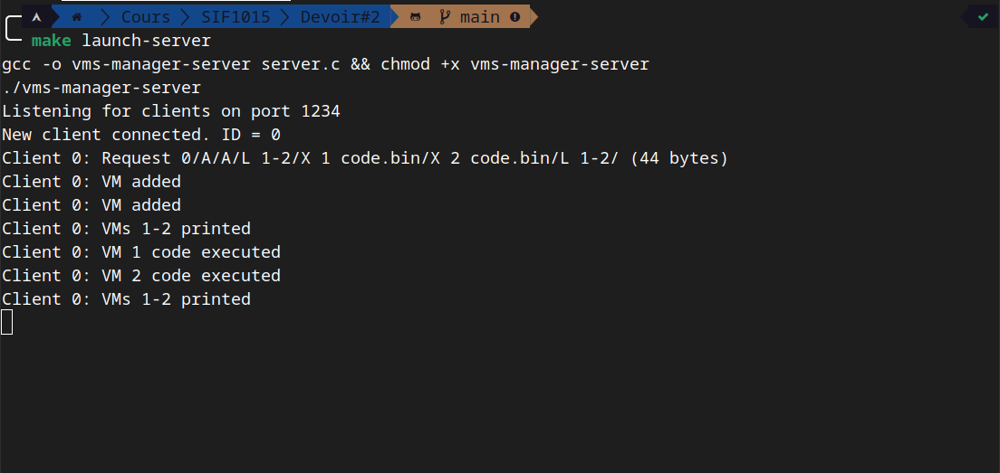
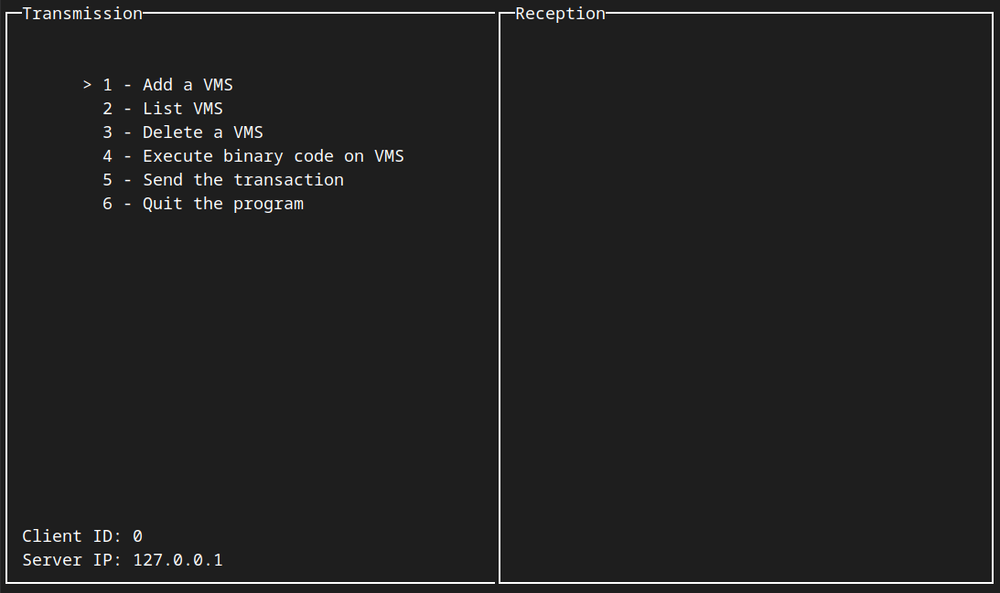
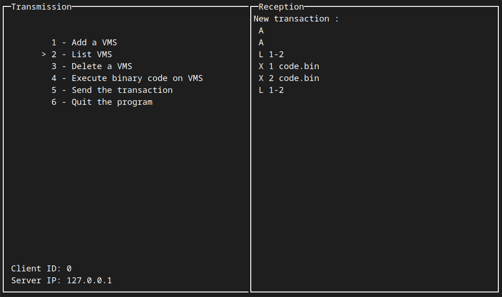
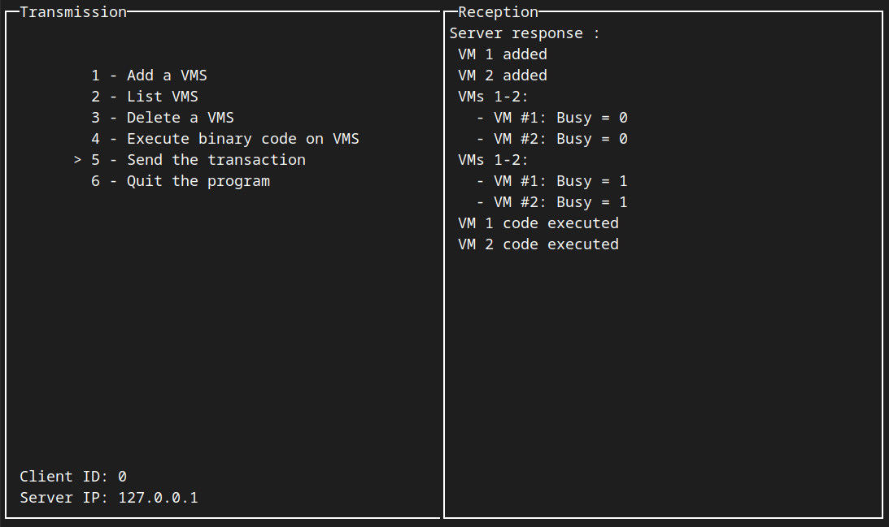

# SIF1015 - Devoir #2 
# Manuel utilisateur

Projet réalisé par Julio Bangadebia et Quentin Anière

## Description

Ce projet est la suite logique du devoir 1. La gestion de la liste chaînée des VMS est la même. Ce qui change c'est la façon dont les transactions sont lues : avant c'était à partir d'un fichier texte, maintenant c'est à partir de sockets.

Un client, via son interface graphique compose une transaction qui est constituée d'opérations. La transaction est envoyée au serveur qui la traite et retourne le résultat à l'utilisateur.

## Compilation

### Serveur

#### Avec makefile

```bash
make server
```

#### Sans makefile

```bash
gcc -o server server.c 
```

### Client

#### Avec makefile

```bash
make client
```

#### Sans makefile

```bash
gcc -o client client.c 
```

## Utilisation

### Serveur

#### Avec makefile

```bash
make launch-server
```

#### Sans makefile

```bash
./server
```

### Client

#### Avec makefile

```bash
make launch-client
```

#### Sans makefile

```bash
./client
```

### Options

Pour choisir le port (client et serveur) :

#### Avec makefile

```bash
make launch-< server | client > port=< port >
```

#### Sans makefile

```bash
./< server | client > < port >
```

## Opérations possibles

 * A - Ajouter une VMS
 * L x - y - Lister les VMS avec un identifiant compris entre x et y
 * E x - Éliminer une VMS avec un identifiant x
 * X x y - Exécuter le code binare compris dans le fichier y sur la VMS x

## Fonctionnement

### Client

1. Le client affiche une interface graphique
2. L'utilisateur compose une transaction à l'aide de l'interface graphique (Les opérations sont définies plus haut)
3. Le client envoie la transaction au serveur (via un socket)
4. Le client affiche le résultat de la transaction

### Serveur

1. Le serveur attend une transaction (via un socket)
2. Le serveur l'ajoute à une liste FIFO (First In, First Out) de transaction
3. Le serveur traite la première transaction de la liste
4. Le serveur démarre un thread pour chaque opération qui compose la transaction
5. Le serveur attend que tous les threads aient terminé
6. Le serveur retourne le résultat de la transaction au client

## Captures d'écran







