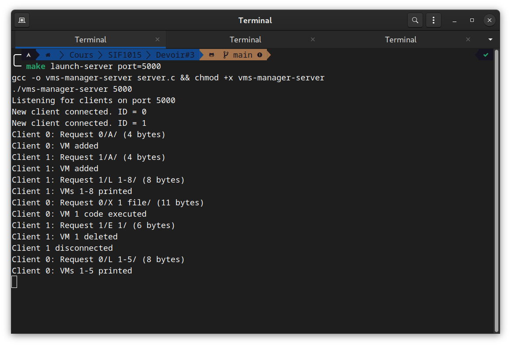
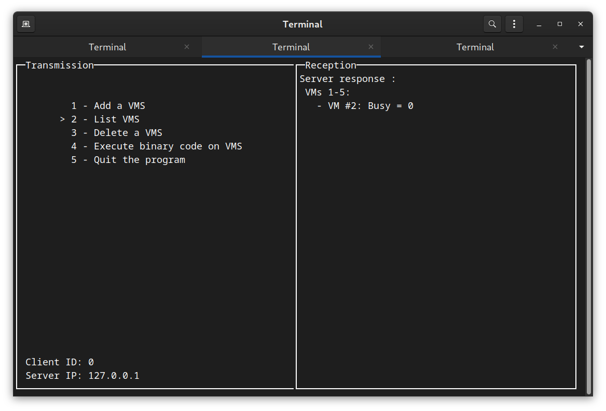

# SIF1015 - Devoir #2 
# Manuel utilisateur

Projet réalisé par Julio Bangadebia et Quentin Anière

## Description

Ce TP est la suite logique du TP2. 

Le changement majeur est qu'au lieu d'envoyer une série de commandes au serveur, on envoie opération par opération.D'autres optimisations ont été faites pour améliorer la performance du serveur.

Le principe reste le même : Le serveur gère de façon concurrente une liste de VMS, sur laquelle les clients peuvent effectuer des opérations. Les opérations sont induites par des sockets. Les opérations sont traitées par une FIFO concurrente, First In, First Out, la première opération reçue sera la première opération traitée.

## Compilation

### Serveur

#### Avec makefile

```bash
make server
```

#### Sans makefile

```bash
gcc -o server server.c 
```

### Client

#### Avec makefile

```bash
make client
```

#### Sans makefile

```bash
gcc -o client client.c 
```

## Utilisation

### Serveur

#### Avec makefile

```bash
make launch-server
```

#### Sans makefile

```bash
./server
```

### Client

#### Avec makefile

```bash
make launch-client
```

#### Sans makefile

```bash
./client
```

### Options

Pour choisir le port (client et serveur) :

#### Avec makefile

```bash
make launch-< server | client > port=< port >
```

#### Sans makefile

```bash
./< server | client > < port >
```

## Opérations possibles

 * A - Ajouter une VMS
 * L x - y - Lister les VMS avec un identifiant compris entre x et y
 * E x - Éliminer une VMS avec un identifiant x
 * X x y - Exécuter le code binaire compris dans le fichier y sur la VMS x

## Fonctionnement

### Serveur

 * Le serveur est lancé (via les commandes ci-dessus) sur un port
 * Il attend une connexion d'un client
 * Une fois le client connecté, le serveur lance un thread pour gérer les opérations du client
 * Le serveur attend un commande du client
 * Le serveur exécute la commande du client  
 * Le serveur envoie le résultat de l'opération au client
 * Le serveur attend une nouvelle commande du client
 * Si le client se déconnecte, il le notifie dans la console, ferme le socket de communication et tue le thread

Les opérations sont traités par une FIFO concurrente :

 * Toute opération est ajoutée à la FIFO
 * Le client lit la première opération de la FIFO
 * Le serveur l'exécute et retourne le résultat au client qui l'a ajouté à la FIFO uniquement

### Client

 * Le client est lancé (via les commandes ci-dessus) en spécifiant le port du serveur et l'adresse IP du serveur
 * Le client se connecte au serveur via le port et l'adresse IP spécifiés
 * Il affiche deux fenêtres : 
    * Une fenêtre pour saisir les commandes
    * Une fenêtre pour afficher les résultats
    * Un thread est lancé pour lire les résultats du serveur, et les afficher dans la fenêtre de résultats
 * Dès que l'utilisateur sélectionne une opération, le client envoie la commande au serveur
 
### Captures d'écran



Les logs du serveur sont affichés dans la console. On voit que deux clients était connectés et que les deux ont effectués différentes opérations. On voit également que le client 1 s'est déconnecté. On peut aussi constater que j'ai lancé le serveur sur le port 5000.



L'interface du coté client, on voit la dernière réponse du serveur.
