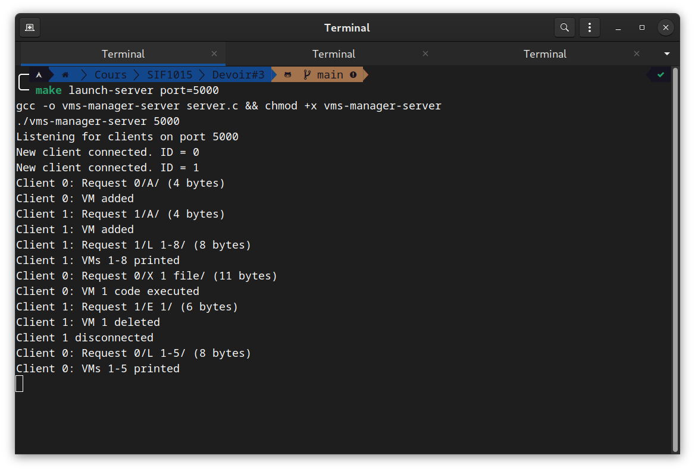
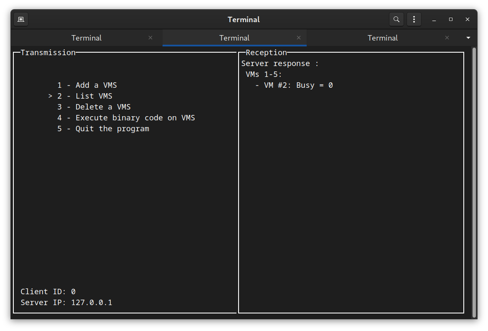

# VMS-Manager

Made by Julio Bangadebia and Quentin Anière

## Description

The server concurrently manages a list of VMS, on which clients can perform operations. Operations are induced by sockets. Operations are processed by a concurrent FIFO, First In, First Out, the first operation received will be the first operation processed.

### Screenshots



The server logs are displayed in the console. We can see that two clients were connected and that both performed different operations. We can also see that client 1 has disconnected. We can also see that I launched the server on port 5000.




## Compilation

### Server

#### With makefile

```bash
make server
```

#### Without makefile

```bash
gcc -o server server.c 
```

### Client

#### With makefile

``bash
make client
```

#### Without makefile

``bash
gcc -o client client.c 
```

## Usage

### Server

#### With makefile

```bash
make launch-server
```

#### Without makefile

``bash
./server
```

### Client

#### With makefile

```bash
make launch-client
```

#### Without makefile

```bash
./client
```

### Options

To choose the port (client and server) :

#### With makefile

```bash
make launch-< server | client > port=< port >
```

#### Without makefile

```bash
./< server | client > < port >
```

## Possible operations

 * A - Add a VMS
 * L x - y - List VMS with an ID between x and y
 * E x - Eliminate a VMS with an identifier x
 * X x y - Execute the binary code included in the file y on the VMS x

## Operation

### Server

 * The server is started (via the above commands) on a port
 * It waits for a connection from a client
 * Once the client is connected, the server starts a thread to manage the client operations
 * The server waits for a command from the client
 * The server executes the client command  
 * The server sends the result of the operation to the client
 * The server waits for a new command from the client
 * If the client disconnects, it notifies it in the console, closes the communication socket and kills the thread

Operations are processed by a concurrent FIFO:

 * Any operation is added to the FIFO
 * The client reads the first operation of the FIFO
 * The server executes it and returns the result to the client who added it to the FIFO only

### Client

 * Client is started (via the above commands) by specifying the server port and the server IP address
 * The client connects to the server via the specified port and IP address
 * It displays two windows: 
    * A window to enter the commands
    * A window to display the results
    * A thread is started to read the results from the server, and display them in the results window
 * As soon as the user selects an operation, the client sends the command to the server
 